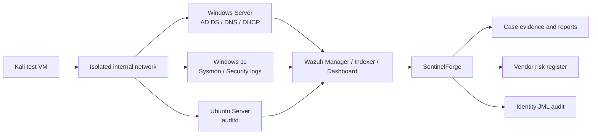

# Architecture

## Logical design

## Network zones

| Zone | Example CIDR | Purpose |
|---|---:|---|
| Management | 10.10.10.0/24 | Hypervisor and administration |
| Workstations | 10.10.20.0/24 | Windows endpoints and attack simulator |
| Servers | 10.10.30.0/24 | Domain controller, Ubuntu and Wazuh |

Use host-only/internal networking and a controlled NAT gateway only for updates. Never bridge deliberately vulnerable targets directly onto an untrusted network.

## Data flow

1. Endpoints create Windows Event Log, Sysmon and auditd telemetry.
2. Wazuh agents transmit events to the manager over the isolated network.
3. Wazuh rules generate alerts and dashboards support investigation.
4. Analysts record validated events, IOCs and ATT&CK mappings in SentinelForge.
5. Reports are exported as Markdown and sanitised before publication.

## Components

- **Wazuh:** primary SIEM and endpoint telemetry platform.
- **SentinelForge:** portfolio case management and GRC application.
- **SQLite:** local demonstration database. Replace with PostgreSQL for shared deployments.
- **Streamlit:** interactive analyst interface.
- **Docker Compose:** one-command application runtime.

## Security boundaries

- Synthetic demonstration data is loaded automatically.
- Raw logs, packet captures, secrets and personal data are excluded from version control.
- Offensive testing is limited to authorised lab systems.
- Reports distinguish observed evidence from analyst inference.
